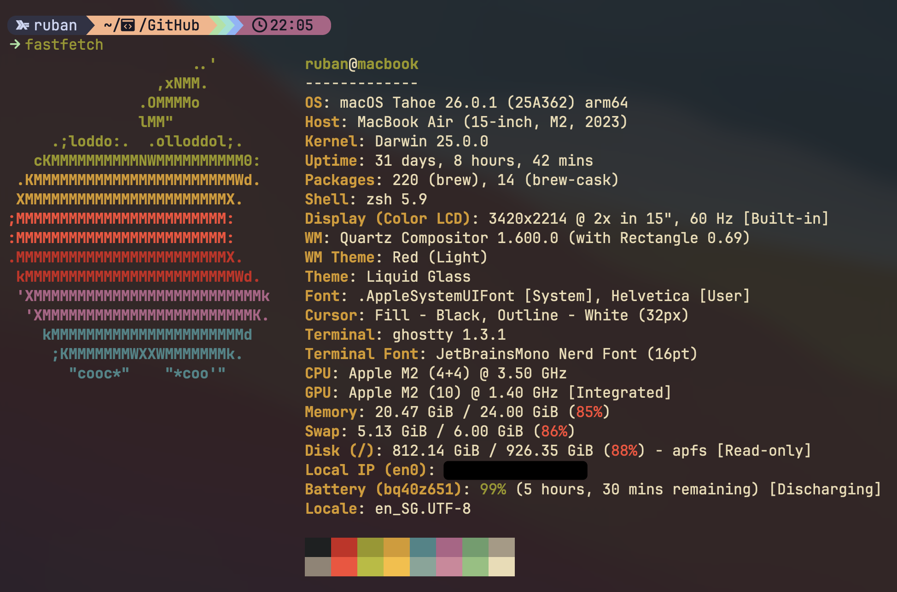

# dotfiles

My personal dotfiles repository.



## Installation

```bash
git clone "https://github.com/sk-ruban/dotfiles"
cd dotfiles
./install.sh
```

Installs Homebrew, everything in `homebrew/Brewfile`, Claude Code, cship and Python via uv, then symlinks each config to where its tool expects it. Safe to re-run — existing files are backed up to `<file>.backup` before being replaced.

## Layout

```
zsh/         zshrc
tmux/        tmux.conf
starship/    starship.toml
homebrew/    Brewfile
nvim/        init.lua, lua/plugins/*
helix/       config.toml
ghostty/     config
zed/         settings.json, themes/
wezterm/     wezterm.lua        (kept for reference, using ghostty)
claude/      CLAUDE.md, commands/, cship*.toml
codex/       AGENTS.md
mac/         system preference scripts, run manually
```

## Manual steps

`install.sh` doesn't do these:

- **Statusline** — `~/.claude/settings.json` isn't tracked. `install.sh` prints the `statusLine` block to paste if it isn't already configured.
- **System preferences** — the scripts in `mac/` use `defaults write` to change Dock, Finder and keyboard settings. Run them individually.
- **tmux plugins** — start tmux and press `prefix + I`.

## Requirements

macOS.
